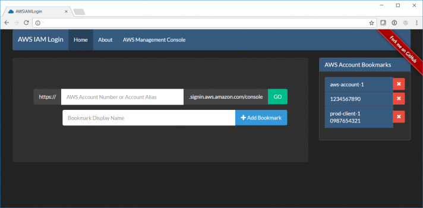

AWS IAM Login
===================

AWS IAM Login makes it easy to navigate across multiple AWS accounts through bookmarks.

<h2>https://naveen-vijay.github.io/awsiamlogin/</h2>

### Features

 - Maintaining bookmarks of AWS accounts with friendly name 
 - No data stored at Server [effective use of Local Storage] 
 - One-Click Navigation to AWS account
 - Restore accidentally closed ***AWS Management Console page*** without having to relogin again
 - Restore accidentally closed ***AWS Management Console page (GovCloud)*** without having to relogin again
 

 
